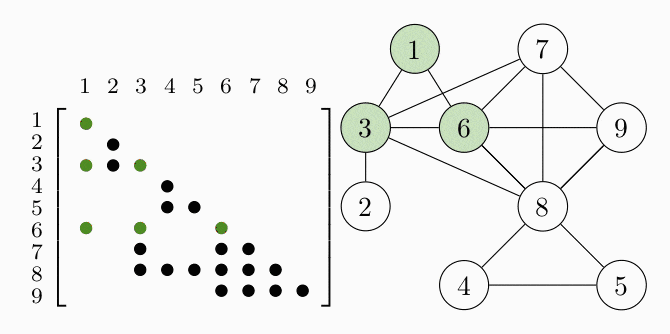
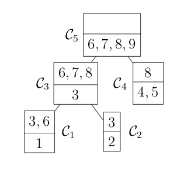
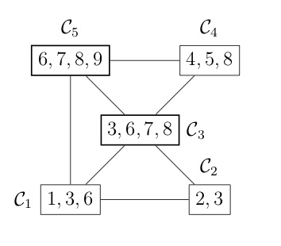
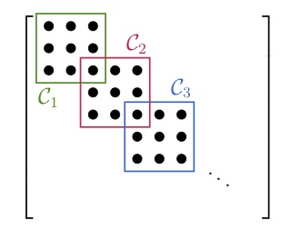
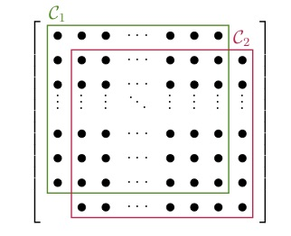
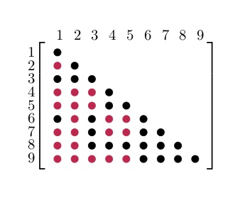

# Chordal Decomposition

For very large sparse semidefinite programs (SDPs) it is often helpful to analyse the sparsity structure of the PSD constraint(s). If the equality constraints impose a sparsity structure on the matrix variable, one PSD constraint on a large matrix variable can be decomposed into several smaller constraints. This results usually in a significant speedup and reduction in solve time.

The following example gives a short overview on chordal decomposition and clique merging. For more details, take a look at our [paper](https://arxiv.org/abs/1911.05615) on clique merging.

## Example problem
Let's consider the following SDP in standard dual form:
```math
\begin{array}{ll}
 \text{minimize} & c^\top x \\
  \text{subject to} &\displaystyle \sum_{i=1}^m A_i x + S = B\\
                  & S \in \mathbb{S}^n_+,
\end{array}
```
with problem data matrices ``A_1, \ldots, A_m, B \in \mathbb{S}^n``, vector variable ``x \in \mathbb{R}^n``, and matrix variable  ``S \in \mathbb{S}^n_+``.

Let's look at the following example problem with ``m=2`` and  ``n=9``:

```@example
A1 = [-4.0 0.0 -2.0 0.0 0.0 -1.0 0.0 0.0 0.0; 0.0 -3.0 -1.0 0.0 0.0 0.0 0.0 0.0 0.0; -2.0 -1.0 -2.0 0.0 0.0 5.0 4.0 -4.0 0.0; 0.0 0.0 0.0 -4.0 -5.0 0.0 0.0 3.0 0.0; 0.0 0.0 0.0 -5.0 4.0 0.0 0.0 2.0 0.0; -1.0 0.0 5.0 0.0 0.0 5.0 -4.0 -4.0 -5.0; 0.0 0.0 4.0 0.0 0.0 -4.0 -1.0 -1.0 -3.0; 0.0 0.0 -4.0 3.0 2.0 -4.0 -1.0 2.0 -2.0; 0.0 0.0 0.0 0.0 0.0 -5.0 -3.0 -2.0 -3.0];

A2 = [-5.0 0.0 3.0 0.0 0.0 -2.0 0.0 0.0 0.0; 0.0 -3.0 -5.0 0.0 0.0 0.0 0.0 0.0 0.0; 3.0 -5.0 3.0 0.0 0.0 5.0 -4.0 -5.0 0.0; 0.0 0.0 0.0 3.0 2.0 0.0 0.0 -2.0 0.0; 0.0 0.0 0.0 2.0 4.0 0.0 0.0 -3.0 0.0; -2.0 0.0 5.0 0.0 0.0 1.0 -5.0 -2.0 -4.0; 0.0 0.0 -4.0 0.0 0.0 -5.0 -2.0 -3.0 3.0; 0.0 0.0 -5.0 -2.0 -3.0 -2.0 -3.0 5.0 3.0; 0.0 0.0 0.0 0.0 0.0 -4.0 3.0 3.0 -4.0];

B = [-0.11477375644968069 0.0 6.739182490600791 0.0 0.0 -1.2185593245043502 0.0 0.0 0.0; 0.0 1.2827680528587497 -5.136452036888789 0.0 0.0 0.0 0.0 0.0 0.0; 6.739182490600791 -5.136452036888789 7.344770673489607 0.0 0.0 -0.2224400187044442 -10.505300166831221 -1.2627361794562273 0.0; 0.0 0.0 0.0 10.327710040060499 8.91534585379813 0.0 0.0 -6.525873789637007 0.0; 0.0 0.0 0.0 8.91534585379813 0.8370459338528677 0.0 0.0 -6.210900615408826 0.0; -1.2185593245043502 0.0 -0.2224400187044442 0.0 0.0 -3.8185953011245024 -0.994033914192722 2.8156077981712997 1.4524716674219218; 0.0 0.0 -10.505300166831221 0.0 0.0 -0.994033914192722 0.029162208619863517 -2.8123790276830745 7.663416446183705; 0.0 0.0 -1.2627361794562273 -6.525873789637007 -6.210900615408826 2.8156077981712997 -2.8123790276830745 4.71893305728242 6.322431630550857; 0.0 0.0 0.0 0.0 0.0 1.4524716674219218 7.663416446183705 6.322431630550857 0.5026094532322212];

c = [-0.21052661285686525, -1.263324575834677];
```


Note that the data matrices ``A_1,\dots, A_m, B`` all have the same sparsity pattern (common zeros in certain entries). Take a look at ``A_1``:
```@repl
A1 = [-4.0 0.0 -2.0 0.0 0.0 -1.0 0.0 0.0 0.0; 0.0 -3.0 -1.0 0.0 0.0 0.0 0.0 0.0 0.0; -2.0 -1.0 -2.0 0.0 0.0 5.0 4.0 -4.0 0.0; 0.0 0.0 0.0 -4.0 -5.0 0.0 0.0 3.0 0.0; 0.0 0.0 0.0 -5.0 4.0 0.0 0.0 2.0 0.0; -1.0 0.0 5.0 0.0 0.0 5.0 -4.0 -4.0 -5.0; 0.0 0.0 4.0 0.0 0.0 -4.0 -1.0 -1.0 -3.0; 0.0 0.0 -4.0 3.0 2.0 -4.0 -1.0 2.0 -2.0; 0.0 0.0 0.0 0.0 0.0 -5.0 -3.0 -2.0 -3.0] # hide
A1
```
Since all the data matrices have zeros in the same places, the equality constraint of the problem tells us that our matrix variable ``S`` will also have zeros in these places.
The _aggregated_ pattern matrix of ``S`` is shown in the following figure, where a dot represents a nonzero entry:



Since the matrices are symmetric we only show the lower triangle. We can represent the aggregated sparsity pattern of the problem using a graph ``G(V, E)``, where the vertex set ``V`` is given by the column indices of the matrix and we introduce an edge ``(i,j) \in E`` for every nonzero matrix element ``S_{ij}``. The graph for the example problem is shown in the right figure. In order to decompose the problem, we have to find the _cliques_, i.e. completely connected subgraphs, of the graph ``G``. These cliques represent the dense subblocks of non-zero entries in the matrix (see the colored entries in the figure). In order for the theory to work, we also have to require ``G`` to be a [chordal](https://en.wikipedia.org/wiki/Chordal_graph) graph. For the purpose of this example, we just assume that ``G`` is chordal and keep in mind that we can always make a graph chordal by adding more edges.

`COSMO` finds the cliques of the graph automatically, if a constraint of type `COSMO.PsdCone` or `COSMO.PsdConeTriangle` is present in the problem and additional equality constraints impose a structure on them. For the example problem `COSMO` finds the following cliques: ``\mathcal{C_1}=\{1,3,6\}, \; \mathcal{C_2}=\{2,3\}, \; \mathcal{C_3}=\{3,6,7,8\}, \; \mathcal{C_4}=\{4,5,8\}`` and ``\mathcal{C_5}=\{6,7,8,9\}``.

Let's denote the set of cliques ``\mathcal{B}=\{\mathcal{C}_1,\ldots,\mathcal{C_p}\}``. To represent the relationship between different cliques, e.g. in terms of overlapping entries, it is helpful to represent them either as a clique tree ``\mathcal{T}(\mathcal{B}, \mathcal{E})`` (left) or a clique graph ``\mathcal{G}(\mathcal{B}, \xi)`` (right), shown in the following figures:




Once the cliques have been found, we can use the following theorem to decompose the problem (and speed up the solver significantly).

__Theorem__ (_Agler's Theorem_)

Let ``G(V,E)`` be a chordal graph with a set of maximal cliques ``\{\mathcal{C}_1,\ldots,\mathcal{C}_p \}``. Then ``S \in \mathbb{S}^n_+(E,0)`` if and only if there exist matrices ``S_\ell \in S^{|\mathcal{C}_\ell|}`` for ``\ell = 1,\ldots,p`` such that

```math
S = \displaystyle \sum_{\ell = 1}^p T_\ell^\top S_\ell T_\ell,
```
where ``T_\ell`` is an entry-selector matrix that maps the subblocks ``S_\ell`` into the correct entries of the original matrix ``S``.

In other words, instead of solving the original problem and choosing ``S`` to be positive semidefinite, we only have to choose the subblocks ``S_\ell`` of the matrix ``S`` to be positive semidefinite and make sure that the individual blocks "add up" to ``S``. Thus, we can solve the equivalent problem:
```math
\begin{array}{ll}
 \text{minimize} & c^\top x \\
  \text{subject to} &\displaystyle \sum_{i=1}^m A_i x + \sum_{\ell = 1}^p T_l^\top S_\ell T_\ell = B\\
                  & S_\ell \in \mathbb{S}^{|\mathcal{C}_\ell|}_+, \; l = 1, \ldots, p.
\end{array}
```
Compare this again with the problem at the top of the page. We have replaced the positive semidefinite constraint on the matrix variable ``S`` by ``p`` constraints on the smaller subblocks ``S_\ell``. Why is this useful?

When solving an SDP, the major linear algebra operation is a projection onto the constraint set, see [Method](@ref). This projection is done at each iteration of the algorithm and for positive semidefinite constraints involves an eigenvalue decomposition of the matrix iterate. Unfortunately, an eigenvalue decomposition of a matrix of dimension ``n`` has a complexity of roughly ``\mathcal{O}(n^3)``.

For our example this means that we now project one ``2\times 2`` block, two ``3 \times 3`` blocks and two ``4 \times 4`` blocks instead of one ``9 \times 9`` block. For small problems, this doesn't seem to make much of a difference, but consider of a problem with 1000 ``11 \times 11`` blocks along the diagonal and overlapping by one entry. Taking into account that the computational cost scales cubicly, we can improve the performance of the solver by projecting 1000 ``11\times 11`` blocks instead of projecting one giant ``10001\times 10001`` block at each iteration.

Let's go back to our example and solve it with `COSMO` and `JuMP`:
```julia
model = JuMP.Model(with_optimizer(COSMO.Optimizer, decompose = true, merge_strategy = COSMO.NoMerge));
@variable(model, x[1:2]);
@objective(model, Min, c' * x )
@constraint(model, Symmetric(B - A1  .* x[1] - A2 .* x[2] )  in JuMP.PSDCone());

JuMP.optimize!(model)
```
Notice that we set the solver settings `decompose = true` to allow `COSMO` to decompose the problem. Furthermore, we set the clique merging strategy to `COSMO.NoMerge`. This just means that after we have found the cliques we don't attempt to merge some of them (more about clique merging below). We get the following output from the solver:
```julia
------------------------------------------------------------------
          COSMO v0.5.0 - A Quadratic Objective Conic Solver
                         Michael Garstka
                University of Oxford, 2017 - 2019
------------------------------------------------------------------

Problem:  x ∈ R^{13},
          constraints: A ∈ R^{35x13} (70 nnz),
          matrix size to factor: 48x48 (188 nnz)
Sets:     PsdConeTriangle of dim: 10
          PsdConeTriangle of dim: 10
          PsdConeTriangle of dim: 6
          PsdConeTriangle of dim: 6
          PsdConeTriangle of dim: 3
Decomp:   Num of original PSD cones: 1
          Num decomposable PSD cones: 1
          Num PSD cones after decomposition: 5
          Merge Strategy: NoMerge
Settings: ϵ_abs = 1.0e-04, ϵ_rel = 1.0e-04,
          ϵ_prim_inf = 1.0e-06, ϵ_dual_inf = 1.0e-04,
          ρ = 0.1, σ = 1.0e-6, α = 1.6,
          max_iter = 2500,
          scaling iter = 10 (on),
          check termination every 40 iter,
          check infeasibility every 40 iter,
          KKT system solver: QDLDL
Setup Time: 0.14ms

Iter:   Objective:  Primal Res: Dual Res:   Rho:
40  -1.4134e+00 1.2320e-05  3.0409e-05  1.0000e-01

------------------------------------------------------------------
>>> Results
Status: Solved
Iterations: 40
Optimal objective: -1.4134
Runtime: 0.002s (1.93ms)
```
Under _sets_ we can indeed see that `COSMO` solved a problem with five PSD constraints corresponding to the cliques ``\mathcal{C}_1,\ldots, \mathcal{C}_5`` discovered in the sparsity pattern. (Note that the dimension printed is the number of entries in the upper triangle of the matrix block.)


## Clique merging
After we have found the cliques of the sparsity pattern, we are allowed to merge any two of them back together. For the graph of the sparsity pattern this just means adding more edges or treating some _structural_ zeros as _numerical_ zeros. The main reason to merge two cliques is that they might overlap a lot and therefore it is not advantageous to treat them as two different blocks. Consider the two extreme cases below:




In the left figure we have the ideal case that all the blocks overlap in just one entry. A full decomposition would leave us with a large number of small blocks. The sparsity pattern in the right figure has two large blocks overlapping almost entirely. In this case it would be disadvantageous to decompose the blocks. Instead, we would do the initial decomposition, realize the large overlap, and then merge the two blocks back together. For sparsity patterns that arise from real applications the case is not always as clear and we have to use more sophisticated strategies to decide which blocks to merge.

`COSMO` currently provides three different strategies that can be selected by the user:

```@docs
COSMO.NoMerge
COSMO.ParentChildMerge
COSMO.CliqueGraphMerge
```
In our example problem we have two cliques ``\mathcal{C}_3 = \{ 3,6,7,8\}`` and ``\mathcal{C}_5 = \{6,7,8,9 \}`` that overlap in three entries. Let's solve the problem again and choose the default clique merging strategy `merge_strategy = COSMO.CliqueGraphMerge`:
```julia
model = JuMP.Model(with_optimizer(COSMO.Optimizer, decompose = true, merge_strategy = COSMO.CliqueGraphMerge));
@variable(model, x[1:2]);
@objective(model, Min, c' * x )
@constraint(model, Symmetric(B - A1  .* x[1] - A2 .* x[2] )  in JuMP.PSDCone());

JuMP.optimize!(model)
```

```julia
------------------------------------------------------------------
          COSMO v0.5.0 - A Quadratic Objective Conic Solver
                         Michael Garstka
                University of Oxford, 2017 - 2019
------------------------------------------------------------------

Problem:  x ∈ R^{7},
          constraints: A ∈ R^{30x7} (58 nnz),
          matrix size to factor: 37x37 (153 nnz)
Sets:     PsdConeTriangle of dim: 15
          PsdConeTriangle of dim: 6
          PsdConeTriangle of dim: 6
          PsdConeTriangle of dim: 3
Decomp:   Num of original PSD cones: 1
          Num decomposable PSD cones: 1
          Num PSD cones after decomposition: 4
          Merge Strategy: CliqueGraphMerge
Settings: ϵ_abs = 1.0e-04, ϵ_rel = 1.0e-04,
          ϵ_prim_inf = 1.0e-06, ϵ_dual_inf = 1.0e-04,
          ρ = 0.1, σ = 1.0e-6, α = 1.6,
          max_iter = 2500,
          scaling iter = 10 (on),
          check termination every 40 iter,
          check infeasibility every 40 iter,
          KKT system solver: QDLDL
Setup Time: 0.26ms

Iter:   Objective:  Primal Res: Dual Res:   Rho:
40  -1.4134e+00 1.7924e-05  1.0416e-04  1.0000e-01

------------------------------------------------------------------
>>> Results
Status: Solved
Iterations: 40
Optimal objective: -1.4134
Runtime: 0.003s (2.68ms)
```
Unsurprisingly, we can see in the output that `COSMO` solved a problem with four PSD constraints. One of them is of dimension 15, i.e. a ``5\times 5`` block, which correspond to the merged clique ``\mathcal{C_3} \cup \mathcal{C}_5 = \{3,6,7,8,9 \}``.

## Completing the dual variable
After a decomposed problem is solved, we can recover the solution to the original problem by assembling the matrix variable ``S`` from its subblocks ``S_\ell``:
```math
S = \displaystyle \sum_{\ell = 1}^p T_\ell^\top S_\ell T_\ell,
```
Following Agler's Theorem, ``S`` will be a positive semidefinite matrix. However, this is not true for the corresponding dual variable matrix ``Y``.  The dual variable returned after solving the decomposed problem will be in the space of PSD completable matrices ``Y \in \mathbb{S}_+^n(E,?)
``. This means that the entries in ``Y`` corresponding to the blocks ``S_\ell`` (black dots) have been chosen correctly. The numerical values for all the other entries (corresponding to the zeros in ``S`` and denoted with a red dot) have to be chosen in the right way to make ``Y`` positive semidefinite.



For more information about PSD matrix completion and the completion algorithm used in `COSMO` take a look at _Vandenberghe and Andersen - Chordal Graphs and Semidefinite Optimization_ (Ch.10). To configure `COSMO` to complete the dual variable after solving the problem you have to set the `complete_dual` option:
```julia
model = JuMP.Model(with_optimizer(COSMO.Optimizer, complete_dual = true));
```

### Example Code
The code used for this example can be found in [/examples/chordal_decomposition.jl](examples/chordal_decomposition.jl).
